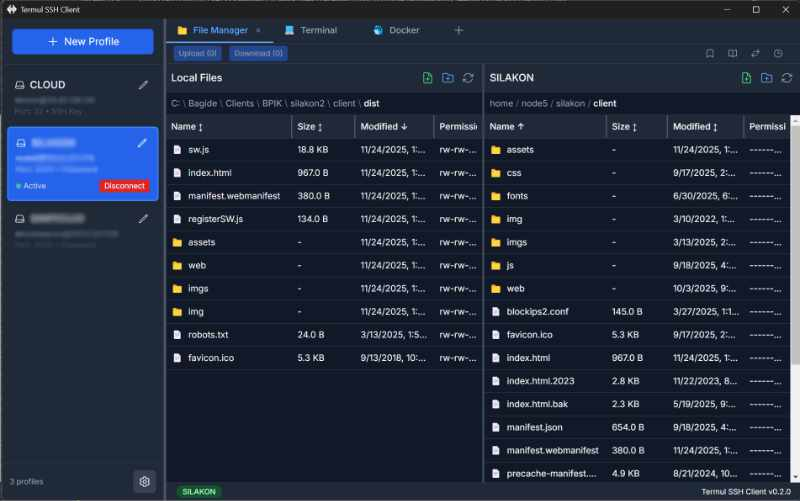
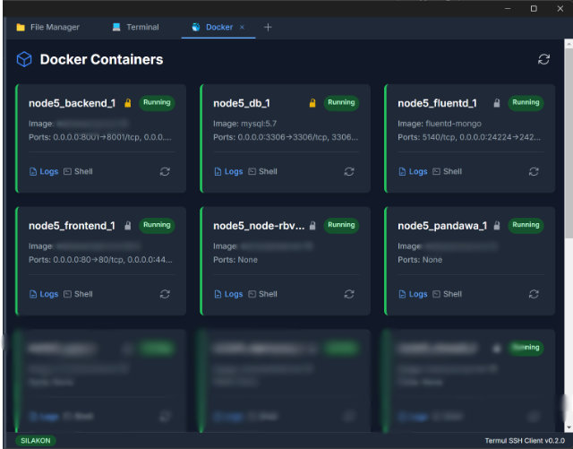

# Termul
(BUKAN Ternak Mulyono :)

**The Modern, Cross-Platform SSH Client & File Manager.**
*A powerful alternative to WinSCP, built for the modern web era.*


## 📸 Screenshots




## ✨ Features

### 🚀 Core Capabilities
- **Dual-Pane File Manager**: Intuitive drag-and-drop interface for local and remote file management.
- **Integrated Terminal**: Full-featured SSH terminal with xterm.js support.
- **Docker Management**: Monitor, restart, and pin Docker containers directly from the UI.
- **File Editor**: Built-in editor with syntax highlighting for quick remote edits.

### ⚡ Productivity
- **Advanced Transfer Queue**: Resumable transfers, parallel processing, and conflict resolution.
- **Smart History & Bookmarks**: Jump back to recent files or save favorite locations.
- **Connection Profiles**: Securely manage and organize your server connections.

### 🛡️ Security
- **Secure Storage**: Industry-standard encryption for credentials (DPAPI/Keychain).
- **Key Management**: Support for SSH keys with passphrase protection.

## 🛠️ Tech Stack

Built with cutting-edge technologies for performance and reliability:
- **Electron** & **React**
- **TypeScript** & **Vite**
- **Tailwind CSS**
- **Node.js**

## 🏁 Getting Started

### Prerequisites
- Node.js 20+
- Git

### Installation

```bash
# Clone the repo
git clone https://github.com/termul/termul-ssh-client.git
cd termul-ssh-client

# Install dependencies
npm install

# Start development
npm run dev
```

## 📦 Building

```bash
npm run build       # Build for production
npm run dist        # Create installer
```

## 🤝 Contributing

Contributions are welcome! Check out our [Contributing Guide](CONTRIBUTING.md).

---

**Termul** — Redefining remote server management.