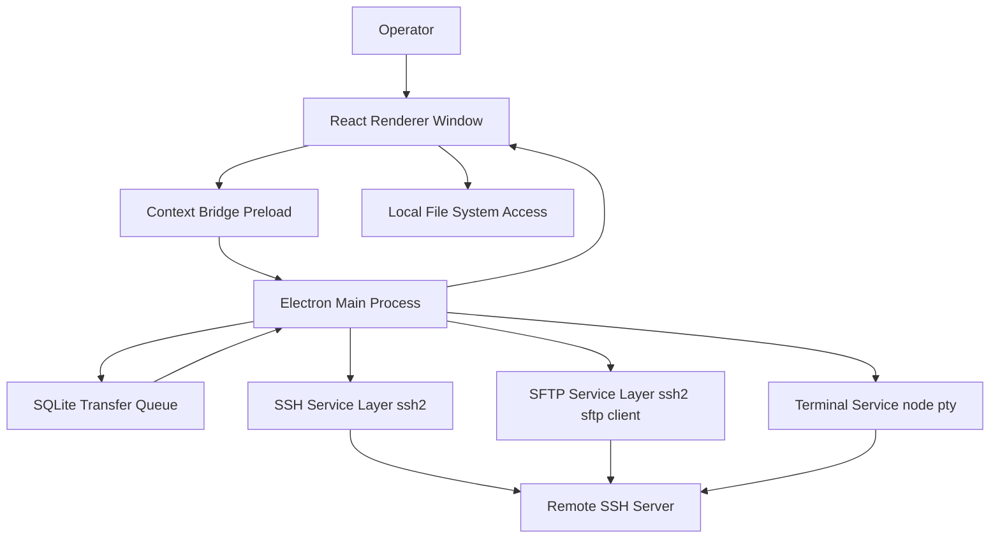
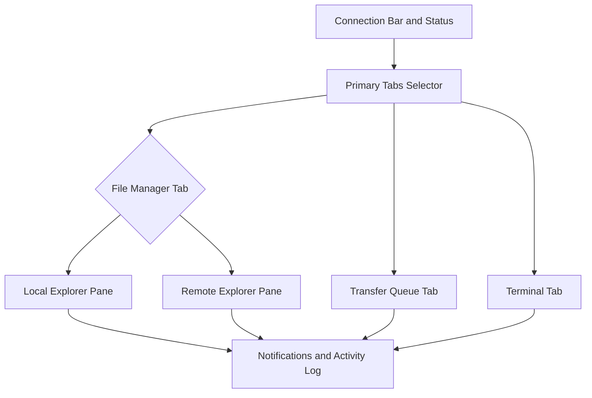

# Electron SSH Client Architecture

## Overview
The Windows focused Electron application hosts a single SSH session per window, presenting a dual pane file manager with drag and drop transfers, a managed transfer queue, and an embedded terminal bound to the active connection. The main process governs lifecycle, secure IPC, and persistence, while the React renderer delivers the interactive experience with optimistic updates and error recovery.

### Key Design Goals
- Maintain strict separation between privileged Node APIs and the renderer through context isolated preload bridges.
- Provide resilient SSH and SFTP connectivity with resumable transfers and actionable status feedback.
- Keep UI state responsive by delegating network and disk heavy tasks to background services and worker threads.
- Support future features such as multi session windows and auto updates without re architecting core primitives.

## High Level Component Topology

## Process Responsibilities
| Process | Responsibilities | Key Dependencies |
| --- | --- | --- |
| Electron main | Application lifecycle, window management, configuration loading, secure storage access, orchestration of SSH SFTP terminal services, transfer queue scheduler | electron, electron builder, better sqlite3, node ssh, ssh2 sftp client, node pty |
| Preload | Expose whitelisted asynchronous IPC bridges for file listings, transfer commands, terminal data, and credential prompts. Enforce schema validation and permission checks before invoking main services. | electron contextBridge, zod |
| Renderer | React UI, state management, optimistic updates, drag and drop interactions, progress visualization, error surfacing, and invoking IPC bridges | React, Vite, Tailwind CSS, Headless UI, Zustand, React Query |
| Worker threads | Parallel file hashing, SFTP chunk processing, and transfer verification tasks to avoid blocking the main event loop | Node worker threads, stream pipelines |

## Renderer Module Layout
- Shell: Application chrome delivering navigation tabs for File Manager, Transfer Queue, and Terminal, along with connection profile selector.
- File Manager: Two synchronized panels (Local, Remote) sharing a unified selection model and supporting drag and drop via HTML5 DataTransfer augmented with Electron file paths.
- Transfer Queue: Table view with filtering, per item progress, retry controls, and persisted history sourced from SQLite.
- Terminal: xterm.js instance with status banner, reconnect controls, and transcript download.
- Notifications and Logs: Global toast system for transient feedback and a dockable log viewer subscribing to IPC emitted events.

## IPC Channels and Data Flow
| Channel | Direction | Payload | Purpose |
| --- | --- | --- | --- |
| `ipc://session/connect` | Renderer to Main | host, port, authStrategy, credentialsId | Establish SSH session and provision services |
| `ipc://session/status` | Main to Renderer (push) | connectionState, latency, serverBanner | Update UI on lifecycle and keepalive metrics |
| `ipc://fs/local/list` | Renderer to Main | path | Retrieve local directory metadata through privileged fs module |
| `ipc://fs/remote/list` | Renderer to Main | path | Request remote directory listing via SFTP service |
| `ipc://transfer/enqueue` | Renderer to Main | array of transfer descriptors | Persist jobs, schedule workers, emit queue updates |
| `ipc://transfer/progress` | Main to Renderer (push) | jobId, transferredBytes, throughput, eta | Drive progress bars and status messages |
| `ipc://terminal/input` | Renderer to Main | utf8 data | Send keystrokes into node pty bound SSH shell |
| `ipc://terminal/output` | Main to Renderer (push) | utf8 data | Stream remote stdout stderr into xterm display |
| `ipc://profile/store` | Renderer to Main | profile payload | Save connection profiles after validation and encryption |

## Transfer Queue Lifecycle
1. Renderer composes transfer descriptors (source, destination, direction, preferences) and issues `ipc://transfer/enqueue`.
2. Main process validates descriptors, writes queue record to SQLite, and spawns or reuses a worker thread.
3. Worker thread performs chunked SFTP operations, leveraging ssh2-sftp-client streams with resume offsets where supported.
4. Progress events are emitted to the renderer, which updates UI and allows user controls (pause, resume, cancel).
5. Completion or failure states persist back to SQLite with contextual metadata for audit and retry tooling.

## Terminal Session Integration
- Once an SSH session is active, Electron main initializes a node-pty instance attached to the ssh2 shell channel.
- Preload forwards bidirectional data between renderer and main, applying throttling to avoid renderer overload.
- Renderer maintains terminal state in local React context, with optional logging to disk triggered by user action.
- Terminal lifecycle events (start, close, error) share the same session status feed used by other components to maintain coherent UX.

## Extensibility and Future Enhancements
- Multiple window support can be enabled by instantiating additional renderer windows bound to separate session contexts.
- Auto update and crash reporting can plug into electron-builder once MVP stabilizes.
- Remote sync and directory comparison may be introduced by expanding the worker thread pool performing hashing and diffing.

## Security Model

### Credential Storage
- Connection profiles persisted in SQLite with only metadata; sensitive secrets stored using Windows Credential Manager via keytar.
- SSH private keys referenced by absolute path with optional encrypted copy stored locally; encryption uses AES-256-GCM with a master key derived from Windows DPAPI.
- Passphrase caching held in-memory per session, wiped on disconnect or app close; optional timeout configurable (default 15 minutes).

### IPC and Context Isolation
- Renderer never receives raw credentials. Requests handled through preload validation requiring explicit scopes (e.g. `session.connect` vs `profile.save`).
- Zod schemas enforce payload constraints and reject disallowed properties to mitigate prototype pollution.
- IPC channels utilize unique namespaces and require nonce based challenge responses to avoid stale invocation replay after reloads.

### SSH Session Hardening
- Enforce modern cipher suites by configuring ssh2 to prefer `chacha20-poly1305` and `aes256-gcm`.
- Verify host keys against a known hosts store; prompt user on first connect with fingerprint confirmation and persistence option.
- Maintain keepalive packets with configurable interval; detect anomalies and surface warnings after consecutive failures.

### Logging and Audit
- Segregated log streams: general application logs (info/error) and transfer audit trail.
- Sensitive values redacted in logs; ability to toggle verbose SSH debug output for troubleshooting which requires explicit user confirmation and temporary storage.

### Update and Integrity Considerations
- Code signing for packaged artifacts before distribution.
- Optional future auto-update mechanism will validate signatures before applying patches.
- Renderer assets hashed and verified on load to detect tampering.

## UI and UX Layout

### Layout Positions
- Top bar hosting connection selector, quick actions, and global status indicators.
- Left sidebar for saved profiles and transfer filters, collapsible to maximize workspace.
- Core workspace divided into three tabs sharing context: File Manager, Transfer Queue, Terminal.

### File Manager Interaction Model
- Dual tree and list hybrid allowing folder navigation via breadcrumb and side tree.
- Keyboard shortcuts for common actions matching Windows explorer (F5 refresh, Ctrl C copy path).
- Drag and drop from local pane to remote initiates upload; remote to local initiates download.
- Context menus with transfer, rename, delete, permissions editing (remote only).
- Inline status badges for transfer in progress and synchronization hints.

### Transfer Queue Experience
- Segmented controls for Active, Scheduled, Completed views.
- Each row shows direction icon, paths, size, throughput, ETA, and action buttons.
- Bulk actions: pause all, resume all, clear completed.
- Detail drawer reveals chunk history, retries, and error messages.

### Terminal UX
- Tab header displays session host and latency indicator.
- Toolbar actions: reconnect, clear, copy output, download log.
- Split view support for optional reference panel (e.g., running tail command while browsing files).

### Accessibility and Responsiveness
- Tailwind component tokens mapped to high contrast themes.
- Focus outlines and ARIA attributes for keyboard navigation.
- Layout adapts down to 1024 width by stacking panes vertically with toggle controls.

## File Transfer Workflow Definition
1. User selects source items and initiates transfer via drag and drop or context menu.
2. Renderer synthesizes transfer descriptors (source path, destination path, direction, overwrite policy, priority) and submits through IPC enqueue.
3. Main process validates permissions, writes pending job into SQLite, and emits optimistic UI update.
4. Scheduler assigns jobs to a worker pool respecting per host concurrency limits; workers stream files using SFTP with resume offsets when metadata permits.
5. Progress events emit every 250ms with transferred bytes and throughput; renderer updates queue and pane badges.
6. On conflicts, renderer surfaces modal with options (overwrite, rename, skip); decision fed back to queue to continue.
7. Completed jobs persist result state with timestamps; failures include diagnostic codes and suggested remediation.
8. Users may pause or cancel jobs; pause stores last offset for future resume, cancel cleans temporary chunks.

## Development Roadmap

### Milestone 0 — Foundations (Weeks 1-2)
- Scaffold Electron + Vite + React project structure.
- Implement secure IPC bridge scaffolding and sample communication loop.
- Establish SQLite persistence layer and profile schema.
- Integrate Tailwind styling baseline and layout shell.

### Milestone 1 — Connectivity Core (Weeks 3-4)
- Implement connection manager with ssh2 session lifecycle and host key validation.
- Build local and remote file listing services with basic navigation UI.
- Deliver terminal tab with xterm.js connected to SSH shell.
- Persist profiles with keytar integration and DPAPI protected secrets.

### Milestone 2 — Transfer Mechanics (Weeks 5-6)
- Develop transfer queue persistence, scheduler, and worker threads.
- Enable drag and drop transfers with progress visualization.
- Handle conflict resolution flows and resume support.
- Add logging pipeline and diagnostics panel.

### Milestone 3 — UX Polish and Hardening (Weeks 7-8)
- Complete accessibility pass, keyboard shortcuts, and responsive layout adjustments.
- Add detailed error handling, retry controls, and session health indicators.
- Implement session logging export and settings UI for cache timeout.
- Prepare installer packaging via electron-builder and conduct smoke testing.

### Milestone 4 — Beta Stabilization (Weeks 9-10)
- Collect feedback from pilot users, triage bugs, performance tuning.
- Expand automated tests (unit for services, integration for IPC and transfers).
- Document deployment, provide getting started guide, and plan auto update integration for post beta.
